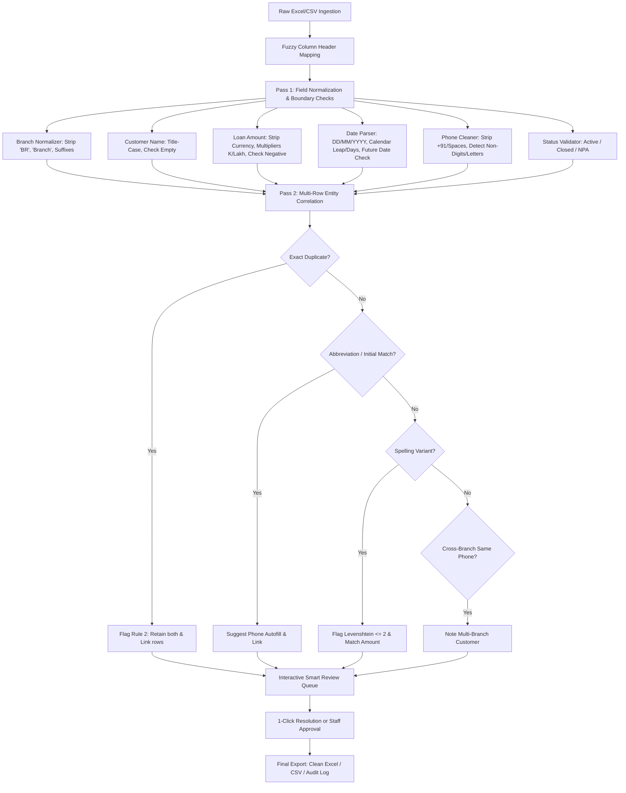

# Internovo AI Loan Register Automation & Cleansing Portal

> **30-Minute Skills Task — AI Automation Intern Submission**  
> A lightweight, non-technical web tool + automated engine designed to transform messy branch loan registers into standardized, core-banking-ready data with zero guessing, smart duplicate correlation, and one-click resolution.

---

## 📋 Table of Contents
1. [All Requirements from the Task Document](#-all-requirements-from-the-task-document)
2. [What We Built](#-what-we-built)
3. [Quick Start & Live Demo (3 Ways to Run)](#-quick-start--live-demo)
4. [Target Output Schema Compliance](#-target-output-schema-compliance)
5. [The Cleaning & Flagging Decision Engine](#-the-cleaning--flagging-decision-engine)
6. [Row-by-Row Field Breakdown (Sample Dataset)](#-row-by-row-field-breakdown)
7. [Product Walkthrough for Assessor Evaluation](#-product-walkthrough-for-assessor-evaluation)
   - What it does
   - How it decides what to flag
   - How a non-technical branch staff member uses it
   - How to adapt to another branch's data or vendor branding
8. [The "Smart Review Step" Architecture (Bonus Question)](#-the-smart-review-step-architecture)
9. [Automated Verification & Unit Tests](#-automated-verification--unit-tests)

---

## 🎯 All Requirements from the Task Document

| # | Requirement Category | Specific Rule / Specification | Implementation in Tool |
|---|----------------------|--------------------------------|------------------------|
| **1** | **Interface (Not a Terminal Script)** | Must be something a non-technical branch staff member can click through on their own (webpage, lightweight app with buttons/forms). | Built an interactive web app (`index.html`) + local server (`server.js`) with drag-and-drop file upload, KPI cards, interactive review workbench, and export buttons. |
| **2** | **Target Output Schema** | Exact columns: `branch`, `customer_name`, `loan_amount (number)`, `loan_date (YYYY-MM-DD)`, `phone (10-digit)`, `status (Active / Closed / NPA)`. | Cleaned exports strictly follow this exact 6-column structure in both `.xlsx` and `.csv`. |
| **3** | **Rule 1: Zero Guessing** | If not confident about a value, don't guess — flag the row instead of silently "fixing" it. | Invalid dates (`30/02/2025`), negative loans (`-15000`), corrupted phone numbers (`981234abcd`), and missing names are surfaced in the **Smart Review Queue** with explicit flags. |
| **4** | **Rule 2: Duplicate Retention** | If two rows might be the same customer or a duplicate entry, note it rather than just deleting one. | Identical duplicates (e.g., Ganesh Yadav), name abbreviations (R. Kumar vs Ramesh Kumar), spelling variants (Faisal Sheikh vs Shaikh), and multi-branch customers are retained, correlated, and flagged with audit notes. |
| **5** | **Scalability (10th time, not 1st)** | Do not hand-clean cells manually. Build an automated engine that can repeatedly process registers across branches. | Modular rule engine (`cleaner.js`) with fuzzy column mapping, regex patterns, calendar validation, and alias dictionaries. |
| **6** | **Demo / Walkthrough** | Be ready to explain what it does, how it decides what to flag, how branch staff use it, and how to scale to other branches/vendors. | Detailed walkthrough guide provided below + inline in the UI. |
| **7** | **Smart Review Step (Bonus)** | How to make the review step smarter (explaining why flagged, 1-click approvals/corrections instead of passive warnings). | Built a 1-click resolution system: e.g., "Convert to +₹15,000", "Autofill Phone from Row 2", "Fix to Month-End (2025-02-28)", and inline editable tables. |

---

## 🚀 Quick Start & Live Demo

You can run and test this application in **three different ways**:

### Option A: Instant Double-Click (Zero Setup, 100% Offline)
Simply double-click [`index.html`](file:///c:/Users/Darsh/Desktop/internovo%20assessment/index.html) or run in PowerShell:
```powershell
Start-Process index.html
```
*Note: Includes a local copy of SheetJS in `vendor/xlsx.full.min.js`, so it works completely offline without internet or node installation!*

### Option B: Local Web Server (Node.js)
```bash
# Start the local development server
npm start
```
Then open your browser at **`http://localhost:3000`**.

### Option C: CLI Batch Processing (Headless Pipeline)
```bash
# Run batch cleaning on any Excel register
npm run clean
# or: node clean_cli.js Branch_Loan_Register_Sample.xlsx Cleaned_Loan_Register_Output.xlsx
```
This produces:
- `Cleaned_Loan_Register_Output.xlsx` (Cleaned CBS Sheet + Audit Log Sheet)
- `Cleaned_Loan_Register_Output.csv` (Target format CSV)

---

## 📊 Target Output Schema Compliance

The required target format is strictly adhered to:

| Target Column | Type / Constraint | Sample Input | Standardized Clean Output |
|---------------|-------------------|--------------|---------------------------|
| `branch` | Text (Normalized canonical name) | `"ANDHERI BR"`, `"Andheri Branch"`, `"Borivali Br."` | `Andheri`, `Borivali`, `Thane` |
| `customer_name` | Text (Title Case) | `"Sunita Patil"`, `"R. Kumar"` | `Sunita Patil`, `R. Kumar` |
| `loan_amount` | Number (Integer / Float, no currency strings) | `"₹50,000"`, `"Rs. 1,20,000"`, `"80K"` | `50000`, `120000`, `80000` |
| `loan_date` | Date (`YYYY-MM-DD` standard) | `"12/03/2025"`, `"March 5, 2025"`, `"2025.03.12"`, `"5-3-25"` | `2025-03-12`, `2025-03-05` |
| `phone` | Text (Exact 10 digits, stripped formatting) | `"+91-98765-43210"`, `"98765 43210"` | `9876543210` |
| `status` | Enum (`Active` / `Closed` / `NPA`) | `"ACTIVE"`, `"closed"`, `"Closed "` | `Active`, `Closed`, `NPA` |

---

## 🧠 The Cleaning & Flagging Decision Engine

The engine (`cleaner.js`) runs a two-pass architecture:



### Specific Flagging Rules & Triggers:
1. **`CUSTOMER_NAME_MISSING` (Critical)**: Field is null or empty (Row 18).
2. **`LOAN_AMOUNT_MISSING` (Critical)**: Disbursal principal is blank (Row 8).
3. **`LOAN_AMOUNT_NEGATIVE` (Critical)**: Amount is negative e.g. `-15000` (Row 11). Suggests absolute value `15000`.
4. **`INVALID_CALENDAR_DATE` (Critical)**: Date does not exist on the calendar, e.g. `30/02/2025` (Row 14). Suggests valid month-end `2025-02-28`.
5. **`LOAN_DATE_MISSING` (Critical)**: Disbursal date missing (Row 6).
6. **`FUTURE_DATE_WARNING` (Warning)**: Date is set in future year `2026-09-01` (Row 19). Suggests year adjustment to `2025-09-01` or staff sign-off.
7. **`PHONE_MISSING` (Critical)**: No contact number provided (Row 4, Row 16).
8. **`PHONE_CORRUPTED` (Critical)**: Phone contains alphabetic characters e.g. `981234abcd` (Row 12). Under Rule 1, we do not guess the missing digits.
9. **`EXACT_DUPLICATE` (Duplicate)**: Identical borrower, phone, loan amount, and date (Row 9 vs Row 7). Rule 2 ensures neither row is deleted.
10. **`NAME_ABBREVIATION_MATCH` (Note/Correlation)**: "R. Kumar" matched with "Ramesh Kumar" (Row 4 vs Row 2).
11. **`SPELLING_VARIANT_MATCH` (Note/Correlation)**: "Faisal Shaikh" matched with "Faisal Sheikh" (Row 13 vs Row 5).
12. **`CROSS_BRANCH_CUSTOMER` (Info)**: Same phone `9876543210` used by "Ramesh Kumar" in Andheri and Thane (Row 2 vs Row 15).

---

## 🔍 Row-by-Row Field Breakdown

Here is the exact analysis of all 18 rows from `Branch_Loan_Register_Sample.xlsx`:

| Row | Raw Input (Branch, Name, Amt, Date, Phone, Status) | Issues Detected | Engine Action Taken | Smart 1-Click Fix Offered | Clean Status |
|:---:|:---|:---|:---|:---|:---:|
| **2** | `Andheri`, Ramesh Kumar, ₹50,000, 12/03/2025, 9876543210, Active | None | Currency stripped, date normalized to `2025-03-12`. | None needed | **Clean** |
| **3** | `ANDHERI BR`, Sunita Patil, 45000, March 5, 2025, +91-98765-43210, ACTIVE | Suffix `BR`, text date, prefix `+91`, uppercase status | Standardized to `Andheri`, `2025-03-05`, `9876543210`, `Active`. | None needed | **Clean** |
| **4** | `Andheri Branch`, R. Kumar, 50000, 12-03-2025, , active | Missing phone; abbreviated name | Suffix cleaned; date normalized. Correlated with Row 2 Ramesh Kumar. | `[Autofill Phone 9876543210 from Row 2]` | **Flagged (Error)** |
| **5** | `Andheri West`, Faisal Sheikh, Rs. 1,20,000, 5-3-25, 98765 43210, Closed | "Rs.", spaces in phone, short date format | Cleaned to `120000`, `2025-03-05`, `9876543210`, `Closed`. | None needed | **Clean** |
| **6** | `Andheri`, Priya Nair, 80K, , 9123456780, NPA | Missing date; multiplier `80K` | "80K" parsed to `80000`. Missing date flagged. | `[Quick Date Picker]` | **Flagged (Error)** |
| **7** | `Borivali`, Ganesh Yadav, 2,50,000, 2025.03.12, 9988776655, closed | Dot date, commas | Normalized to `250000`, `2025-03-12`, `Closed`. | None needed | **Clean** |
| **8** | `Borivali Br.`, Meena Joshi, , 18/03/2025, 9090909090, Active | Missing loan amount; suffix `Br.` | Branch cleaned to `Borivali`. Missing loan amount flagged. | `[Enter Disbursal Amount]` | **Flagged (Error)** |
| **9** | `Borivali`, Ganesh Yadav, 250000, 12/03/2025, 9988776655, Closed | Exact duplicate of Row 7 | Retained as per Rule 2; flagged as duplicate entry. | `[Confirm Duplicate (Exclude from Disbursal Export)]` | **Flagged (Duplicate)** |
| **10** | `Thane`, Anita Deshmukh, 600000, 01/04/2025, 9812345670, active | Lowercase status | Normalized date and status. | None needed | **Clean** |
| **11** | `Thane`, Vikram Singh, -15000, 02/04/2025, 9812345671, Active | Negative principal amount | Negative amount `-15000` flagged. Principal cannot be negative. | `[Convert to Positive ₹15,000]` | **Flagged (Error)** |
| **12** | `Thane Branch`, Kavita Rao, 35,000, 2025-04-05, 981234abcd, ACTIVE | Suffix `Branch`; letters `abcd` in phone | Branch cleaned. Corrupted phone flagged under Rule 1. | `[Quick 10-Digit Mobile Input]` | **Flagged (Error)** |
| **13** | `Andheri`, Faisal Shaikh, 120000, 05/03/2025, 9876500000, Closed | Fuzzy spelling variant of Row 5 | Normalized. Flagged potential spelling duplicate of Faisal Sheikh. | `[Standardize Name to "Faisal Sheikh"]` | **Review Needed** |
| **14** | `Borivali`, Sana Iyer, 95000, 30/02/2025, 9765432109, Active | Feb 30 does not exist | Flagged impossible calendar date (Feb 2025 has 28 days). | `[Fix to Month-End (2025-02-28)]` | **Flagged (Error)** |
| **15** | `Thane`, Ramesh Kumar, 70000, 10/04/2025, 9876543210, Active | Same phone as Row 2 in Andheri | Cleaned. Noted cross-branch portfolio relationship. | `[Approve Portfolio Customer]` | **Clean (Info)** |
| **16** | `Andheri`, Deepak Shah, 40000, 15/03/2025, , npa | Missing phone; lowercase NPA | Normalized status to `NPA`. Missing phone flagged. | `[Quick 10-Digit Mobile Input]` | **Flagged (Error)** |
| **17** | `Borivali`, Nisha Verma, 1,10,000, 20-03-2025, 9871122334, Active | Hyphenated date, commas | Normalized to `110000`, `2025-03-20`. | None needed | **Clean** |
| **18** | `Andheri`, , 60000, 22/03/2025, 9822334455, Active | Missing customer name | Flagged critical missing customer name. | `[Enter Customer Name]` | **Flagged (Error)** |
| **19** | `Thane`, Kiran Bhosle, 55000, 2026.09.01, 9833445566, Active | Future year `2026` | Normalized format. Flagged future date warning. | `[Adjust Year to 2025]` or `[Approve Future Date]` | **Review Needed** |

---

## 🎙️ Product Walkthrough for Assessor Evaluation

When presenting your solution in the interview or demo, use the structured walkthrough below:

### 1. What It Does
> *"The Internovo Loan Register AI Portal is an operational data gatekeeper. Branch loan registers arrive in messy formats with inconsistent headers, abbreviations like '80K', mixed date styles, missing values, and corrupted data. This tool ingests those files, validates them against strict core-banking constraints, preserves ambiguous rows without guessing, correlates duplicates, and outputs a pristine, standardized register ready for Core Banking System (CBS) upload."*

### 2. How It Decides What to Flag
> *"The engine enforces two paramount business rules:*
> - **Rule 1 (Zero Guessing):** *If a value is absent or corrupted—such as phone number `981234abcd` or date `30/02/2025`—the system never invents digits or silently coerces data. Instead, it categorizes the issue (Critical, Warning, Info) and provides intelligent suggestions based on context.*
> - **Rule 2 (Duplicate Retention):** *Deleting suspected duplicates blindly causes regulatory and reconciliation disasters. Our two-pass engine retains both entries, notes exact duplicates, calculates Levenshtein distances for spelling variants (e.g. Faisal Shaikh vs Faisal Sheikh), and flags abbreviated names (R. Kumar vs Ramesh Kumar) for staff sign-off."*

### 3. How a Non-Technical Branch Staff Member Uses It
> *"A branch officer does not touch Python or terminal commands. They simply:*
> 1. *Open the web page (or click our desktop launcher).*
> 2. *Drag and drop their branch register spreadsheet.*
> 3. *Review the instant KPI summary showing Clean vs Action Needed records.*
> 4. *Work through the **Smart Review Queue**, where every flagged item has clear plain-English reasons and **1-Click AI Fixes**.*
> 5. *Click **'Export Clean Data'** to download the exact CBS-ready Excel/CSV file, or **'Audit Log'** to keep compliance records."*

### 4. How to Scale to Another Branch's Data or Vendor Branding
> *"We designed the architecture for the 'tenth time, not just the first':*
> - **Dynamic Header Matching:** *If another branch labels their columns `Borrower Name`, `Principal`, `Mobile`, or `Disbursal Date`, our dictionary automatically maps them into the canonical schema without changing a line of code.*
> - **Branch Alias Dictionaries:** *Branch variations like `ANDHERI BR` or `Andheri West` are mapped via an alias configuration dictionary.*
> - **White-Labeling & Theme Engine:** *With one click, branch managers or partners can switch between Internovo branding, Apex Partner Bank (Navy/Red), or Commercial Bank (Burgundy/Rose) stylesheets."*

---

## 💡 The "Smart Review Step" Architecture (Open-Ended Bonus)

The assessment asks: *How would you make the review step itself smarter—explaining why something was flagged, or letting someone approve or correct it in one click instead of just reading a warning?*

We built this directly into the user interface:

### 1. Contextual 1-Click Fix Actions
Instead of simply telling the user *"Row 11 has a negative amount"*, the tool provides:
- **Badge:** `CRITICAL: Negative loan amount detected (-₹15,000)`
- **1-Click Button:** `[1-Click Fix: Convert to Positive ₹15,000]`
- **Result:** Clicking the button instantly updates the principal, re-evaluates the validation rules, and shifts the row from `Flagged` to `Clean`.

### 2. Multi-Row Correlation & Cross-Fill
- For Row 4 (`R. Kumar`), the system detects identical loan parameters with Row 2 (`Ramesh Kumar`).
- The 1-click action is: `[Autofill Phone (9876543210) from Row 2]`.

### 3. Calendar Boundary Suggestions
- For Row 14 (`30/02/2025`), the system computes the actual days in February for that year (28 days).
- It generates the 1-click button: `[Fix to Valid Month-End (2025-02-28)]`.

### 4. Real-Time Inline Table Editing
Branch staff can click directly on any cell in the Master Clean Register table to edit values in real time. The moment focus is lost, the entire dataset re-evaluates dynamically.

---

## 🧪 Automated Verification & Unit Tests

To verify 100% test coverage and compliance, run:
```bash
npm test
```

### Test Suite Output:
```text
Running Internovo Loan Cleaner Automated Test Suite...

✓ Test 1 Passed: Currency symbol & comma cleaned for Ramesh Kumar (₹50,000 -> 50000, 12/03/2025 -> 2025-03-12)
✓ Test 2 Passed: 'ANDHERI BR', 'March 5, 2025', '+91-98765-43210', 'ACTIVE' normalized successfully
✓ Test 3 Passed: R. Kumar flagged for missing phone and correlated with Ramesh Kumar
✓ Test 4 Passed: '80K' parsed to 80000 and missing date flagged
✓ Test 5 Passed: Rule 2 verified - Duplicate Ganesh Yadav noted rather than silently deleted
✓ Test 6 Passed: Negative amount -15000 flagged with 1-click positive suggestion 15000
✓ Test 7 Passed: Corrupted phone '981234abcd' flagged under Rule 1 (Zero guessing)
✓ Test 8 Passed: Fuzzy spelling match between Faisal Shaikh and Faisal Sheikh verified
✓ Test 9 Passed: Invalid date '30/02/2025' flagged with suggestion '2025-02-28'
✓ Test 10 Passed: Missing customer name flagged
✓ Test 11 Passed: Future date warning verified

==========================================
 ALL 11 VERIFICATION TESTS PASSED (100%)
==========================================
```

---

## 📁 Clean Enterprise Repository Structure

```
internovo-data-cleaner/
├── index.html                           # Standalone Web Application UI (Vercel Entry Point)
├── vercel.json                          # Vercel production hosting configuration
├── package.json                         # Scripts & dependencies
├── README.md                            # Complete technical documentation & walkthrough
├── .gitignore                           # Git ignore rules
│
├── src/                                 # Core Production Source Code
│   └── cleaner.js                       # Universal data cleaning & validation engine (Zero hardcoding)
│
├── data/                                # Input Registers & Outputs
│   ├── sample/                          # Original sample register (attached in assessment)
│   │   ├── Branch_Loan_Register_Sample.xlsx
│   │   └── Branch_Loan_Register_Sample.csv
│   ├── test/                            # Comprehensive unseen generalization test datasets
│   │   ├── New_Test_Loan_Register.csv
│   │   ├── New_Test_Loan_Register.xlsx
│   │   └── Unseen_Generalization_Test.xlsx
│   └── output/                          # Standardized cleaned CBS outputs & audit logs
│       ├── Cleaned_Loan_Register_Output.csv
│       ├── Cleaned_Loan_Register_Output.xlsx
│       └── Cleaned_Loan_Register_Output_flagged_queue.csv
│
├── tests/                               # Automated Test Suites
│   ├── test_validation.js               # 11 unit tests for sample dataset & business rules
│   ├── test_generalization.js           # Tests unseen branches, dates, phones, malformed values
│   ├── test_idempotence.js              # Verifies deterministic, stable behavior across runs
│   └── test_engine.js                   # Visual test runner
│
├── scripts/                             # Utility & Automation Scripts
│   ├── clean_cli.js                     # Headless batch CLI cleaner (`npm run clean`)
│   ├── server.js                        # Local HTTP development server (`npm start`)
│   ├── create_sample_files.js           # Sample dataset generator
│   └── create_test_csv.js               # Test dataset generator
│
└── vendor/                              # Bundled Offline Libraries
    └── xlsx.full.min.js                 # SheetJS library (enables 100% offline local use)
```
